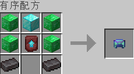
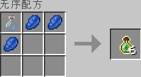
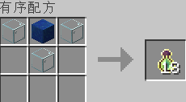
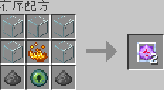

# 新增与简化合成配方

本页面列出服务器所有自定义物品的合成方式。部分原版物品（如末影水晶、附魔之瓶）的配方已被简化，以便玩家快速获取。

## 武器

### 精炼钻石剑
  
高伤害的近战武器。  
*合成配方：* 钻石块x2 下界合金锭x1

### 维京战斧
  
效率VII秒破木头。  
*合成配方：* 木棍x2 钻石块x2 下界合金锭x1

## 护甲

### 头顶尖尖帽
  
提供高强度保护，并附带荆棘 IV 效果(你甚至可以拿来当武器)。  
*合成配方：* 钻石块x1 绿宝石块x4 下界合金锭x2 下界合金升级模板x1

### 精炼钻石胸甲
  
提供三重高强度保护。  
*合成配方：* 钻石块x8 下界合金锭x1

### 重型下界合金靴
  
提供三重超高强度保护。  
*合成配方：* 铁块x2 下界合金锭x4 下界合金升级模板x1

## 工具

### 工人锹
  
效率 X，瞬间挖掘软质方块。  
*合成配方：* 钻石块x1 下界合金锭x1 下界合金升级模板x1

### 幸运镐
  
时运 V，大幅提高前期矿物掉落。  
*合成配方：* 木棍x2 铁块x2 青金石块x1

### 世界吞噬者
  
效率 VII，秒破石头。  
*合成配方：* 木棍x2 钻石块x2 下界合金锭x1

### 冶炼矿镐
  
挖掘矿物时自动将其熔炼为成品。  
*合成配方：* 木棍x2 粗铁x3

## 消耗品与杂项

### 火焰弹
  
可投掷并产生爆炸。  
*合成配方：* 原版火焰弹x1 烈焰粉x1

### 附魔之瓶
  
*简化配方：* 玻璃瓶 + 青金石x3

  
*快速配方：* 玻璃x3 青金石块x1

### 末影水晶
  
*简化配方：* 玻璃x5 火药x2 末影之眼x1 烈焰粉x1