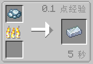
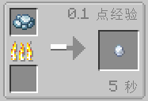
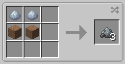
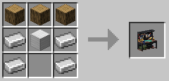
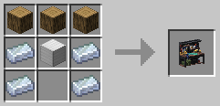
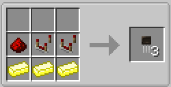
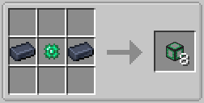
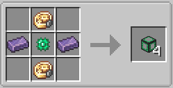
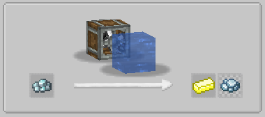

# 物品合成
为了平衡游戏前期的工业流程与服务器玩法，以下物品的合成配方将进行修改添加或删除
## 锇的获取
**原配方**(金属冶炼)  
  
**新配方**(金属冶炼)  

## 锇的量产
**新增配方**(无序合成)  
  

## TaCZ枪械工作台的合成
**原配方**(有序合成)  
  
**新配方**(有序合成)  
  

## 晶体管
**新配方**(有序合成)  
  

## 基础物流管道
**原配方**(有序合成)  
  
**新配方**(有序合成)  
  

## OC2RC
**删除了OC2RC的所有物品合成配方,以避免服务器硬盘占用过大导致钱包空空**

# 物品加工
为了为服务器完善更完整的工业链,我们修改添加或删除了以下物品的加工配方

## 铂矿石特殊加工
为了补充服务器里没有锇矿的痛苦,我们添加了同为铂族元素的铂矿,并添加了对应的矿物处理  
**新增配方**(批量洗涤)  
    

